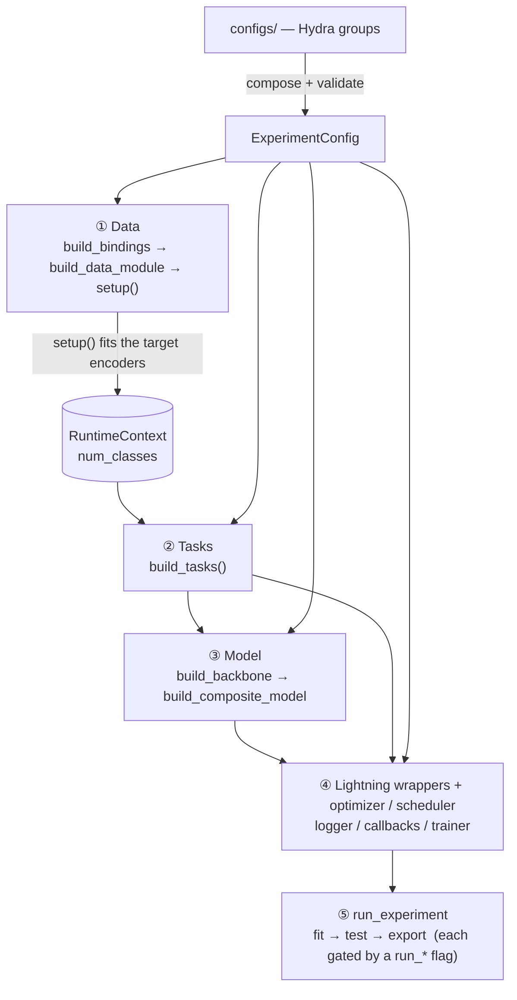
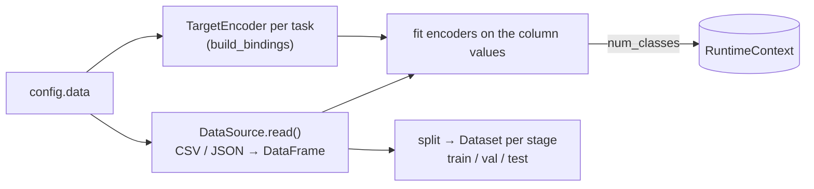
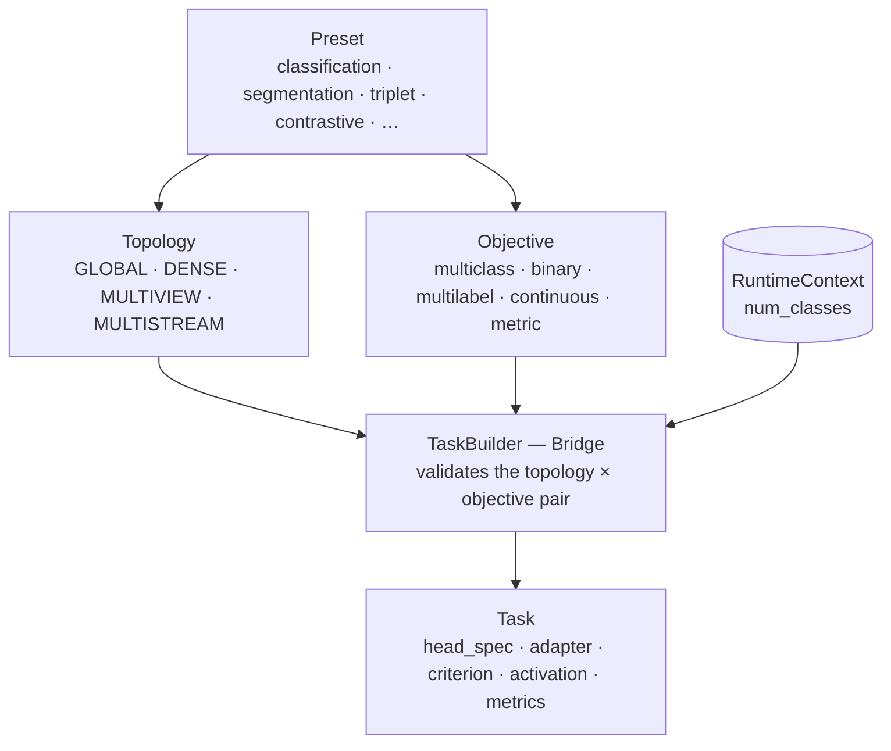
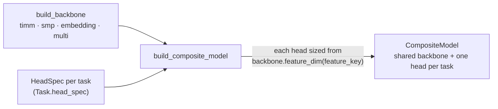
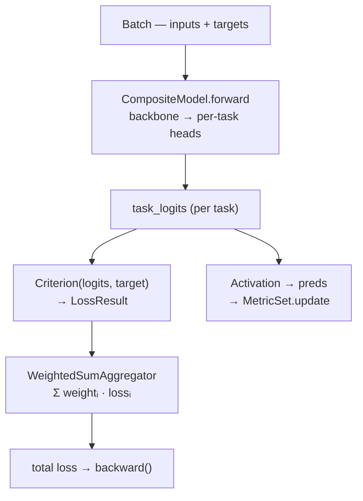

# Framework

Configuration-driven **multi-task & multimodal** computer-vision training on top of
PyTorch Lightning · Hydra · Pydantic · timm / smp · albumentations · torchmetrics.

> Classification · segmentation · regression · **metric learning** (ranking / dual-encoder),
> with model **export** (ONNX / TorchScript / TensorRT) and interactive **sample visualization** built in.

---

## Table of contents

- [Quick start](#quick-start)
- [Core concepts](#core-concepts)
- [Configuration guide](#configuration-guide)
  - [Config reference](#config-reference)
  - [How components are built](#how-components-are-built)
  - [Data](#data)
  - [DataLoader & cache](#dataloader--cache)
  - [Tasks & presets](#tasks--presets)
  - [Embeddings & metric learning](#embeddings--metric-learning)
  - [Backbone](#backbone)
  - [Optimizer, LR & scheduler](#optimizer-lr--scheduler)
  - [Callbacks](#callbacks)
  - [Logger](#logger)
  - [Export](#export)
  - [Sample visualization](#sample-visualization)
- [Recipes](#recipes)
- [CLI reference](#cli-reference)
- [Extending the framework](#extending-the-framework)
- [Internals](#internals)

> The [Config reference](#config-reference) is always visible; the deeper section bodies are
> collapsed — click a heading's summary to expand it.

---

## Quick start

```bash
uv sync           # install dependencies
make test         # verify everything works
```

The entry point is `main.py`. All configuration lives in `configs/`.
Run with the built-in debug experiment (synthetic data, CPU, 2 epochs):

```bash
uv run python main.py
```

To point at your own data, override the experiment:

```bash
uv run python main.py +experiment=my_exp
```

---

## Core concepts

**A Task is a composition of three orthogonal axes.** A *topology* defines the output
structure (global per-sample, dense per-pixel, ranking / multistream for embeddings); an
*objective* defines label semantics (multiclass / multilabel / binary / continuous / metric);
a *modality* defines the input side (image / precomputed embedding / multi-encoder). Familiar
names — `classification`, `segmentation`, `regression`, `triplet`, `contrastive` — are thin
presets over this composition. `segmentation(objective="multilabel")` works out of the box with
no extra code; adding a new variant is one `objective:` change in YAML.

**`num_classes` is never hardcoded.** The data module reads and fits target encoders at
setup time, populates a `RuntimeContext`, and only then are tasks and model heads built
with concrete output dimensions. Class counts flow from data → runtime → model
automatically.

**Hydra groups = swappable building blocks.** Backbone, optimizer, scheduler, dataloader,
transforms, logger, callbacks, trainer, and export are independent config groups. Combine
them freely; override any key via CLI without touching shared config files.

**Train → test → export, one pipeline.** A run executes `fit`, `test`, and model `export`
(ONNX / TorchScript / TensorRT with numerical-parity verification), each gated by a `run_*` flag.
`SampleLogCallback` renders ground-truth-vs-prediction grids to interactive HTML along the way.

---

## Configuration guide

### Config reference

Every YAML key is defined and validated in [`src/config/schema.py`](src/config/schema.py) — the
single source of truth. Each field there carries its own type, default, constraints, and a
one-line description, so the schema doubles as the authoritative reference; the tables below are
a map of the surface. The **root** model rejects unknown keys (`extra="forbid"`), while the
**component sections** (`backbone` · `optimizer` · `scheduler` · `data` · `dataloader` ·
`logger` · `trainer`) allow extras and forward them verbatim to the underlying constructor.

**Top-level keys** (`ExperimentConfig` root):

| Key | Type | Default | Sets |
|---|---|---|---|
| `project` | `str` | — *required* | Project name for tracking. |
| `run_name` | `str` | `null` | Human-readable run name → logger task. `${now:%Y-%m-%d_%H-%M-%S}` for an auto-timestamp. |
| `save_dir` | `str` | `null` | Root for run outputs; `checkpoint.dirpath` defaults to `{save_dir}/checkpoints`. Use `${hydra:run.dir}` to follow Hydra's run dir. |
| `seed` | `int` | `42` | Global random seed. |
| `epochs` | `int` | — *required* | Number of training epochs. |
| `batch_size` | `int` | — *required* | Batch size. |
| `image_size` | `[int, int]` | — *required* | Image `[height, width]` in pixels. |
| `lr` | `float` | — *required* | Global learning rate; referenced as `${lr}`. Override per task via `tasks.<name>.optimizer.lr`. |
| `mean` / `std` | `list[float]` | ImageNet | Normalization statistics (must be equal length). |
| `run_train` / `run_test` / `run_export` | `bool` | `true` | Gate `fit` / `test` / `export` (at least one must be true). |
| `ckpt_path` | `str` | `null` | Checkpoint for `test` — a `.ckpt` path or alias `best` / `last`. Required for eval-only (`run_train: false`). |
| `init_ckpt_path` | `str` | `null` | Load weights before `fit` (pretrain / fine-tune, **not** resume). Requires `run_train: true`. |

**Sections** (each a nested model — full fields in the schema, deep dives linked):

| Section | Required | Configures | Schema | Details |
|---|---|---|---|---|
| `data` | ✓ | `sources`, `inputs`, `split`, `split_stratify`, `cache`, `max_samples`, `root_path` | `DataConfig` | [Data](#data) |
| `dataloader` | default | `num_workers`, `pin_memory`, `persistent_workers`, `drop_last`, `prefetch_factor` | `DataLoaderConfig` | [DataLoader & cache](#dataloader--cache) |
| `backbone` | ✓ | encoder selection (`kind`, `name`, `pretrained`, …) | `BackboneConfig` | [Backbone](#backbone) |
| `optimizer` | ✓ | `name`, `lr`, `weight_decay`, … | `OptimizerConfig` | [Optimizer, LR & scheduler](#optimizer-lr--scheduler) |
| `scheduler` | `null` | LR schedule (`name`, `interval`, `monitor`, `runtime_kwargs`, …); `null` = constant LR | `SchedulerConfig` | [Optimizer, LR & scheduler](#optimizer-lr--scheduler) |
| `tasks` | ✓ (≥1) | per task: `preset`, `target`, `objective`, `head`, `feature_key`, `class_mapping`, `loss`, `metrics`, `weight`, per-head `optimizer` | `TaskConfig` | [Tasks & presets](#tasks--presets) |
| `transforms` | `null` | per-stage Albumentations pipelines (`_target_` graphs) | dict | [How components are built](#how-components-are-built) |
| `logger` | default | tracking backend (`none` / `clearml`) | `LoggerConfig` | [Logger](#logger) |
| `callbacks` | `null` | callbacks by registry key / `_target_` | dict | [Callbacks](#callbacks) |
| `trainer` | default | Lightning `Trainer` knobs (`accelerator`, `devices`, `precision`, `log_every_n_steps`, `profiler`) | `TrainerConfig` | [How components are built](#how-components-are-built) |
| `export` | default | deployment export (per-format `targets`) | `ExportConfig` ([`export.py`](src/config/export.py)) | [Export](#export) |

> Field-level constraints (`lr > 0`, `cache.ram_fraction ∈ [0, 1]`, split ratios summing to
> 1.0, mutually exclusive split / pre-split modes, …) are enforced in the schema's validators —
> open [`src/config/schema.py`](src/config/schema.py) for the exact contract behind any key.

### How components are built

<details>
<summary>Two construction families: typed sections vs. brick-specs (<code>name</code> / <code>_target_</code>)</summary>

Most of the config maps directly onto Python objects. There are **two construction
families** — knowing which one a section uses tells you how to customize it.

**1. Typed sections** — a fixed schema with one dedicated builder. A `kind` (or `name`)
field selects the registry adapter; the remaining fields are forwarded to it as
constructor arguments. Used by `backbone`, `optimizer`, `scheduler`, `data`, `dataloader`,
`logger`, `trainer`.

```yaml
backbone: {kind: smp, name: unet, encoder_name: resnet34}   # kind → adapter; encoder_name forwarded
optimizer: {name: adamw, lr: ${lr}, weight_decay: 1.0e-4}    # name → optimizer class; rest forwarded
```

Typed sections are `extra="allow"`: unknown keys forward verbatim to the underlying
constructor (smp's `encoder_name`, an optimizer's `momentum`, a DataLoader's `timeout`).

**2. Brick-specs** — free-form, with three interchangeable forms. Used by `loss`,
`metrics`, `target_encoder`, `head`, `callbacks`, the `transform` inside a batch
transform, and `trainer.profiler`.

| Form | YAML | Meaning |
|---|---|---|
| string | `loss: cross_entropy` | registry key, default args |
| name + params | `loss: {name: cross_entropy, label_smoothing: 0.1}` | registry key + kwargs |
| `_target_` | `loss: {_target_: my_pkg.MyLoss, alpha: 0.3}` | import path, no registration needed |

The first two forms look the component up in a **registry** (short, discoverable names);
`_target_` imports any class by dotted path — the escape hatch for code you didn't
register. Both reach the same constructor; pick by whether the thing is registered.

**Nested graphs.** A `_target_` spec is resolved recursively, so object trees can be
built inline (e.g. an Albumentations pipeline):

```yaml
transforms:
  train:
    _target_: albumentations.Compose
    transforms:
      - {_target_: albumentations.HorizontalFlip}
      - {_target_: albumentations.Normalize}
      - {_target_: albumentations.pytorch.ToTensorV2}
```

Inside a `_target_`, only `_target_` is available — registry short-names are a
top-level convenience.

**`trainer.profiler` mixes both.** `trainer` is a typed section, but its `profiler`
sub-key is a brick-spec: a string alias (`profiler: simple`) passes straight to
Lightning, while a `_target_` mapping is instantiated so the profiler can declare its
own output path:

```yaml
trainer:
  profiler:
    _target_: lightning.pytorch.profilers.AdvancedProfiler
    dirpath: ${save_dir}     # write the report under the run directory
    filename: profile
```

**Runtime values are injected, never written.** `num_classes` and similar are inferred
from data at `setup()` and injected into the components that need them — which is why you
never write `num_classes` in a loss / metric / transform spec. Any param you set
explicitly overrides an injected default.

**To customize a component** (both shown in [Extending the framework](#extending-the-framework)):
register your class under a short key (`@registry.register("my_key")`) and use the `name`
form, **or** skip registration and point `_target_` straight at it.

> Unlike raw Hydra, `_partial_` and positional `_args_` are not supported — components
> take keyword arguments.

</details>

### Data

<details>
<summary>Split / pre-split modes · multiple inputs · <code>max_samples</code></summary>

**Split mode** — one file, ratios decide the split:

```yaml
data:
  sources: data/annotations.csv
  inputs: image_path          # shorthand: single image column
  split:
    train: 0.8
    val:   0.1
    test:  0.1
```

**Pre-split mode** — separate files per stage:

```yaml
data:
  sources:
    train: data/train.csv
    val:   data/val.csv
  inputs: image_path
```

**Multiple inputs** (multi-view, multimodal):

```yaml
data:
  inputs:
    image:   image_path        # loader auto-detected from extension
    depth:   depth_path        # another image column
    caption: {column: text_col, loader: text}   # explicit loader
```

**Stratified split** — keep class balance across stages:

```yaml
data:
  split: {train: 0.8, val: 0.1, test: 0.1}
  split_stratify: species      # categorical → classification; numeric → quantile-binned
```

**Cap dataset size** for fast iteration:

```yaml
data:
  max_samples: 500       # int → exactly N rows
  max_samples: 0.1       # float → 10% of data
```

**Dataset distribution report.** The `dataset_stats` callback (in the `default` stack) reports,
before the first stage, each task's target distribution per stage — class counts for
classification / multilabel, numeric stats for regression — rendered two ways: a compact table
in the terminal and a grouped-bar histogram per task to the logger (ClearML), with one series
per stage so train/val/test skew is visible at a glance. The data module *computes* the
distributions (`DataModule.statistics()`, each `TargetEncoder` summarizing its own column), so
segmentation (pixel counts) drops in later without touching the report; the callback only
*presents* them. Logging is a no-op without a plot-capable logger.

</details>

### DataLoader & cache

<details>
<summary>Worker knobs (config group + presets) and the in-RAM image/mask cache</summary>

`dataloader` is its own config group. Override per-run, swap a preset, or add a block in an
experiment:

```bash
uv run python main.py dataloader.num_workers=8 dataloader.pin_memory=true
uv run python main.py dataloader=performance      # GPU preset: 8 workers, pin_memory, prefetch 4
uv run python main.py dataloader=debug            # num_workers=0 (real tracebacks / breakpoints)
```

| Knob | Meaning |
|---|---|
| `num_workers` | loader subprocesses (`0` = main process, debug-friendly) |
| `pin_memory` | page-locked host memory → faster CPU→GPU copies (CUDA only) |
| `persistent_workers` | keep workers alive between epochs (auto-off at `num_workers=0`) |
| `drop_last` | drop the last incomplete **train** batch (val/test never drop) |
| `prefetch_factor` | batches prefetched per worker (auto-off at `num_workers=0`) |

Extra keys forward verbatim to `torch.utils.data.DataLoader` (e.g. `timeout`,
`multiprocessing_context`); framework-owned keys (`batch_size`/`shuffle`/`collate_fn`/…) are
rejected so per-stage conventions hold.

**In-RAM cache** — decode each image/mask once, warmed in the parent before training and
read-only after (so it stays shared across fork workers). Budget = `min(ram_fraction · free
RAM, max_gb)`:

```yaml
data:
  cache:
    ram_fraction: 0.5     # cap at half of available RAM (0 disables)
    max_gb: 8             # absolute cap in GiB
    workers: 8            # threads used to warm the cache
```

> The cache + multi-worker only share memory under **fork** (Linux). On macOS (spawn),
> pick one: cache with `num_workers=0`, or workers with the cache off.

</details>

### Tasks & presets

<details>
<summary>Classification · segmentation · regression · objective / loss / metric overrides · per-head LR</summary>

Tasks are declared as a named dict. The key becomes the task name used in metric logs
(`label/accuracy/val`), loss logs (`loss/val/label`), and per-head LR overrides.

**Classification** (multiclass by default):

```yaml
tasks:
  species:
    preset: classification
    target: species_col
    class_mapping: {0: cat, 1: dog, 2: cow}   # infers num_classes=3
```

**Segmentation**:

```yaml
tasks:
  mask:
    preset: segmentation
    target: mask_path
    class_mapping: {0: background, 1: defect, 2: edge}   # infers num_classes=3
```

Or with explicit `num_classes` when class names don't matter:

```yaml
tasks:
  mask:
    preset: segmentation
    target: mask_path
    num_classes: 3
```

**Regression**:

```yaml
tasks:
  age:
    preset: regression
    target: age
    dim: 1
```

**Objective override** — same preset, different label semantics:

```yaml
tasks:
  tags:
    preset: classification
    objective: multilabel       # sigmoid + BCE instead of softmax + CE
    target: tags_col
    class_mapping: {0: indoor, 1: outdoor, 2: people}
```

Available objectives: `multiclass` · `multilabel` · `binary` · `continuous` · `metric`
(metric learning — see [Embeddings & metric learning](#embeddings--metric-learning)).

**Custom loss** (registry keys: `cross_entropy` · `bce` · `mse` · `l1` · `dice` · `focal` ·
`weighted_sum` · `arcface` · metric-learning losses):

```yaml
tasks:
  mask:
    preset: segmentation
    target: mask_path
    num_classes: 3
    loss:
      name: weighted_sum
      losses: {cross_entropy: 1.0, dice: 2.0}
```

**Custom metrics**:

```yaml
tasks:
  species:
    preset: classification
    target: species_col
    class_mapping: {0: cat, 1: dog, 2: cow}
    metrics:
      accuracy: null
      per_class_f1:
        name: f1
        average: none           # returns [C] vector → logged per class
      confusion_matrix: null
```

**Per-head learning rate** (see [Optimizer, LR & scheduler](#optimizer-lr--scheduler)):

```yaml
tasks:
  mask:
    preset: segmentation
    target: mask_path
    num_classes: 3
    optimizer:
      lr: 1.0e-4                # this head gets its own param group
```

</details>

### Embeddings & metric learning

<details>
<summary>Triplet / pairwise ranking (Siamese) and contrastive (dual-encoder, CLIP/SigLIP)</summary>

Metric-learning tasks have no per-sample class label — supervision comes from the
pair/triplet structure or the batch diagonal. The `metric` objective makes the adapter
pass-through and the activation identity; `num_classes` is reinterpreted as the **embedding
dimension** (the projection-head size). The *loss method* is pinned by the preset.

| Preset | Topology | Default loss | Shape of supervision |
|---|---|---|---|
| `triplet` | MULTIVIEW | `triplet_margin` | 3 views: anchor / positive / negative |
| `pairwise_ranking` | MULTIVIEW | `margin_ranking` | 2 views ranked against each other |
| `contrastive` | MULTISTREAM | `info_nce` | N separate encoders aligned (InfoNCE / SigLIP) |

**MULTIVIEW (Siamese)** — N input views go through *one shared backbone* (stacked to
`[B·N, …]`, reshaped to `[B, N, D]`). The view names come from `data.inputs`:

```yaml
data:
  inputs:
    anchor:   anchor_path
    positive: positive_path
    negative: negative_path

tasks:
  embed:
    preset: triplet
    target: anchor_path        # structural; the loss ignores its values
    dim: 128                   # embedding dimension
```

**MULTISTREAM (dual / multi-encoder)** — N *separate* encoders (e.g. image + text), one
named stream each, aligned in a shared space. Use the `multi` backbone whose sub-encoder
names match the `data.inputs` aliases:

```yaml
backbone:
  kind: multi
  encoders:
    image: {kind: timm, name: resnet50}
    text:  {kind: timm, name: ...}      # any registered encoder

tasks:
  align:
    preset: contrastive
    target: image            # structural
    dim: 256
    loss: siglip             # swap info_nce → siglip
```

**Precomputed embeddings** — skip the image encoder entirely with the `embedding`
backbone (the input is a stored feature vector); pair it with `classification` or a metric
preset for ANN/retrieval heads.

> See `configs/experiment/{arcface,contrastive,ranking,embeddings}_smoke.yaml` for runnable
> examples. `arcface` is an angular-margin **loss** you can drop onto a `classification` task.

</details>

### Backbone

<details>
<summary>timm · smp (two feature streams) · embedding · multi-encoder; per-task <code>feature_key</code></summary>

Select the backbone group in `defaults` or override it:

```yaml
defaults:
  - backbone: resnet18    # configs/backbone/resnet18.yaml
```

| Group file | Architecture | Kind |
|---|---|---|
| `resnet18.yaml` | timm ResNet-18 | `timm` |
| `smp_unet.yaml` | smp U-Net (ResNet-34 encoder) | `smp` |
| `smp_dpt.yaml` | smp DPT | `smp` |
| `embedding.yaml` | precomputed feature vectors (no encoder) | `embedding` |

| Kind | Use for |
|---|---|
| `timm` | any timm classifier / encoder (global tasks) |
| `smp` | segmentation & multi-task (two spatial streams) |
| `embedding` | precomputed embeddings modality |
| `multi` | N named encoders for MULTISTREAM (dual-encoder / CLIP-style) |

**timm backbone** (any model from the timm registry):

```yaml
backbone:
  kind: timm
  name: efficientnet_b3
  pretrained: true
```

**smp backbone** for segmentation or multi-task:

```yaml
backbone:
  kind: smp
  name: unet
  encoder_name: resnet34
  pretrained: true
```

SMP exposes two feature streams:

| Key | Shape | Use for |
|---|---|---|
| `decoder` | `[B, D, H, W]` | segmentation head (default for `segmentation` preset) |
| `encoder_last` | `[B, D, H, W]` | classification head with SMP's internal pooling |

For **multi-task on a single smp backbone**, set `feature_key` per task:

```yaml
tasks:
  mask:
    preset: segmentation
    target: mask_path
    num_classes: 3
    # feature_key: decoder  ← default, no need to write

  label:
    preset: classification
    target: label
    class_mapping: {0: cat, 1: dog}
    feature_key: encoder_last   # explicit: use encoder output, not decoder
```

</details>

### Optimizer, LR & scheduler

<details>
<summary>Global / per-head LR, optimizer choice, and LR schedulers with runtime step counts</summary>

```yaml
lr: 1.0e-3          # global LR — all param groups start here

optimizer:
  name: adamw       # registry key: adamw · adam · sgd · rmsprop
  lr: ${lr}         # references the top-level lr
  weight_decay: 1.0e-4
```

Available optimizer groups: `adamw.yaml` · `sgd.yaml`.

**Per-head LR override**: add an `optimizer:` block to any task. That head gets its own
param group; the backbone uses the global `lr`.

```yaml
tasks:
  mask:
    preset: segmentation
    target: mask_path
    num_classes: 3
    optimizer:
      lr: 5.0e-5    # decoder head trains slower than backbone
```

**Scheduler** is its own config group (`cosine` · `onecycle` · `plateau` · `step`; `none`
= constant LR). `interval`/`frequency`/`monitor` map to Lightning's scheduling; extra keys
forward to the scheduler constructor. `runtime_kwargs` fills a constructor argument from a
trainer fact computed at fit time (`total_steps` / `steps_per_epoch` / `epochs`):

```yaml
defaults:
  - scheduler: onecycle

scheduler:
  name: onecycle
  interval: step
  max_lr: ${lr}
  runtime_kwargs: {total_steps: total_steps}   # filled from the trainer at fit time
```

```yaml
# ReduceLROnPlateau — needs a monitored metric
scheduler:
  name: plateau
  interval: epoch
  monitor: loss/val/total
  factor: 0.5
  patience: 3
```

**Per-head LR + OneCycle/Cyclic.** A scalar `max_lr` (or Cyclic's `base_lr`/`max_lr`) is
expanded per param-group, scaled by each group's lr — so a per-head `optimizer.lr` override
carries into the schedule's peak instead of being overwritten. With `max_lr: ${lr}` and a head
at `lr: 1.0e-4`, the head peaks at `1.0e-4` while the backbone peaks at `${lr}`. (`cosine` /
`step` / `plateau` already scale each group's own lr, so they need nothing special.)

</details>

### Callbacks

<details>
<summary>lr_monitor · ema · checkpoint · freeze · sample_log · batch transforms · custom</summary>

`callbacks` is a dict of `{registry_key: params}` — the same pattern as `metrics`.
Keys are looked up in `callback_registry`; values are constructor kwargs (`null` = all defaults).
Declaration order in YAML controls registration order, which matters: put `ema` before `checkpoint`.

```yaml
# configs/callbacks/default.yaml
lr_monitor:
  logging_interval: epoch

ema:
  decay: 0.999
  warmup_fraction: 0.1
  use_buffers: true

checkpoint:
  monitor: loss/val/total
  mode: min
  save_top_k: 1
  save_weights_only: true
```

Select a group in `defaults`:

```yaml
defaults:
  - callbacks: default    # lr_monitor + ema + checkpoint
  # - callbacks: minimal  # checkpoint only
  # - callbacks: none     # no callbacks (smoke tests)
```

| Key | Callback | What it does |
|---|---|---|
| `lr_monitor` | `LearningRateMonitor` | Logs learning rates to the experiment logger |
| `ema` | `EmaCallback` | Maintains an EMA shadow; validation and checkpoints use EMA weights |
| `checkpoint` | `ModelCheckpoint` | Saves the best model by a monitored metric |
| `freeze` | `FreezeCallback` | Freezes modules for the first N epochs, then unfreezes |
| `sample_log` | `SampleLogCallback` | Renders a GT-vs-prediction HTML grid (see [Sample visualization](#sample-visualization)) |
| `progress_bar` | `MetricsProgressBar` | Rich progress bar with live metrics & directions |
| `batch_transform` | `BatchTransformCallback` | Schedules MixUp / CutMix / Mosaic |
| `metric_summary` | `MetricSummaryCallback` | After test, reports headline metrics to the logger's single-value summary (see [Logger](#logger)) |
| `dataset_stats` | `DatasetStatsCallback` | Before the first stage, prints target distributions + logs histograms (see [Data](#data)) |

**Disable a callback at runtime** — delete its key with the `~` prefix:

```bash
uv run python main.py 'defaults=[{override /callbacks: default}]' '~callbacks.ema'
```

**Add freeze** without editing the group file — extend the dict in an experiment config:

```yaml
# configs/experiment/finetune.yaml
callbacks:
  freeze:
    targets: [model.backbone]
    unfreeze_at: 0.3    # fraction of max_epochs; int = epoch index; -1 = never
    train_bn: false
```

**Custom callback** via `_target_` (no registration needed):

```yaml
callbacks:
  my_cb:
    _target_: my_project.callbacks.GradientClipCallback
    max_norm: 1.0
```

**EMA + checkpoint**: when EMA is active, the checkpoint automatically saves EMA weights —
no special setup needed. EMA weights are swapped in before validation (where checkpoint
monitors the metric) and swapped back after.

</details>

### Logger

<details>
<summary>none (default) · ClearML</summary>

```yaml
defaults:
  - logger: none       # no logging (default)
  - logger: clearml    # ClearML experiment tracking
```

**ClearML** config:

```yaml
logger:
  kind: clearml
  project: my-project   # defaults to experiment project
  task: run-001         # optional task name
```

Override at runtime:

```bash
uv run python main.py 'defaults=[{override /logger: clearml}]'
```

**End-of-run summary.** The `metric_summary` callback (in the `default` stack) reports the
headline **test** metrics — scalars plus each vector metric's mean, no per-class noise — to the
logger's single-value summary table (ClearML's "Single Values") via `PlotLogger.log_single_value`,
so the final numbers are visible at a glance. Entries are named as in the live training table
(`species/f1`, `breed/recall`, `mask/iou`, `loss/total` — stage and the `mean` leaf stripped) and
rounded for readability. It is a no-op when the logger does not support it (e.g. `logger: none`);
the detailed per-step scalars and per-class values still log as usual.

</details>

### Export

<details>
<summary>ONNX / TorchScript / TensorRT with numerical-parity verification; combined & per-component graphs</summary>

After `fit`/`test`, the model is exported for deployment (gated by `run_export`). Export is
a config group (`onnx` · `torchscript` · `tensorrt` · `all`); targets are a per-format list, so one
run can emit several formats:

```yaml
defaults:
  - export: onnx        # or: torchscript · tensorrt · all

export:
  targets:
    - {format: onnx, opset_version: 17, dynamic_batch: true, simplify: true}
    - {format: torchscript, method: trace}
  combined: true          # one graph: image → all task logits
  split_components: false # also write backbone + each head as separate files
  output_dir: null        # defaults to {save_dir}/export
```

Each format validates its own option surface at `load_config` time (a misplaced
`opset_version` under `torchscript` fails immediately). Every target is **verified**: the
written artifact is re-run and its outputs compared to the source model within tolerance —

```yaml
export:
  targets:
    - {format: onnx, verify_outputs: true, atol: 1.0e-4, rtol: 1.0e-3}
```

A rich table reports per-output abs/rel error and a pass/fail verdict. Disable export with
`run_export: false` or an empty `targets` list.

**TensorRT.** The `tensorrt` target compiles straight from the PyTorch graph via torch-tensorrt
(no ONNX intermediate) to a serialized engine (`model_*.plan`) written to `{save_dir}/export/`.
The `shapes` profile references `image_size` instead of hardcoding H/W:

```yaml
defaults:
  - export: tensorrt

export:
  targets:
    - format: tensorrt
      precision: fp16          # or fp32
      atol: 1.0e-2             # fp16 needs a looser parity tolerance
      shapes:                  # min/opt/max optimization profile (drop it → batch 1/4/8)
        min: [1, 3, "${image_size.0}", "${image_size.1}"]
        opt: [4, 3, "${image_size.0}", "${image_size.1}"]
        max: [8, 3, "${image_size.0}", "${image_size.1}"]
```

> CUDA-only: a `.plan` engine is hardware + TensorRT-version specific, so build it on a node
> matching your Triton deployment. Install the optional backend once:
> `uv add --optional export-trt torch-tensorrt tensorrt`.

</details>

### Sample visualization

<details>
<summary>Interactive HTML grid of ground-truth vs predictions, via <code>sample_log</code></summary>

`SampleLogCallback` periodically takes a batch, runs the model, and renders a
self-contained interactive **HTML grid**: each cell shows the image with toggleable overlays
— chips for classification/regression labels, full-cell colored masks for segmentation —
and a sidebar to switch ground-truth / prediction layers per task and class.

```yaml
callbacks:
  sample_log:
    num_images: 8
    every_n_epochs: 5
    batch_index: 0
    title_prefix: samples
```

It is label-type agnostic: an `annotators` registry keyed by `(topology, objective)` writes
the GT/pred fields, and a `label_renderers` registry keyed by `Label` type emits the cell
overlays — so a new task kind plugs in without touching the renderer.

</details>

---

## Recipes

<details>
<summary>Single-task classification</summary>

```yaml
# configs/experiment/classify_pets.yaml
# @package _global_
defaults:
  - override /backbone: resnet18
  - override /callbacks: default

project: pets
epochs: 20
batch_size: 32
image_size: [224, 224]
lr: 1.0e-3

data:
  sources: data/pets.csv
  inputs: image_path
  split: {train: 0.8, val: 0.1, test: 0.1}

tasks:
  species:
    preset: classification
    target: species
    class_mapping: {0: cat, 1: dog, 2: rabbit}
```

```bash
uv run python main.py +experiment=classify_pets
```

</details>

<details>
<summary>Multi-task: classification + segmentation on one backbone</summary>

```yaml
# configs/experiment/multitask.yaml
# @package _global_
defaults:
  - override /backbone: smp_unet
  - override /callbacks: default

project: multitask-demo
epochs: 30
batch_size: 8
image_size: [512, 512]
lr: 1.0e-3

data:
  sources: data/annotations.csv
  inputs: image_path
  split: {train: 0.8, val: 0.1, test: 0.1}

tasks:
  mask:
    preset: segmentation
    target: mask_path
    class_mapping: {0: background, 1: defect, 2: edge}
    loss: {name: weighted_sum, losses: {cross_entropy: 1.0, dice: 1.0}}

  label:
    preset: classification
    target: label
    class_mapping: {0: ok, 1: defective}
    feature_key: encoder_last
    optimizer:
      lr: 5.0e-4
```

</details>

<details>
<summary>Metric learning: contrastive dual-encoder alignment</summary>

```yaml
# configs/experiment/align.yaml
# @package _global_
defaults:
  - override /backbone: ...        # a `multi` backbone (image + other encoder)
  - override /callbacks: default
  - override /scheduler: cosine

project: align
epochs: 50
batch_size: 64
lr: 3.0e-4

data:
  sources: data/pairs.csv
  inputs:
    image: image_path
    other: other_path
  split: {train: 0.9, val: 0.1}

tasks:
  align:
    preset: contrastive          # MULTISTREAM + InfoNCE
    target: image                # structural target
    dim: 256
    loss: siglip                 # or info_nce
```

</details>

<details>
<summary>Fine-tuning with a frozen backbone</summary>

```yaml
# configs/experiment/finetune.yaml
# @package _global_
defaults:
  - override /callbacks: default

project: finetune
epochs: 40
lr: 5.0e-4

# Extend the default callback set with freeze.
# Declare freeze before checkpoint so unfreezing runs before the save decision.
callbacks:
  freeze:
    targets: [model.backbone]
    unfreeze_at: 0.25   # unfreeze after 25% of epochs

# ... data and tasks as usual
```

</details>

<details>
<summary>Fast debugging</summary>

```yaml
# configs/experiment/debug_quick.yaml
# @package _global_
defaults:
  - override /trainer: cpu_smoke
  - override /dataloader: debug
  - override /callbacks: none
  - override /logger: none

epochs: 2
batch_size: 4
image_size: [64, 64]

data:
  max_samples: 100

# ... tasks as usual
```

</details>

---

## CLI reference

<details>
<summary>Hydra override syntax — scalars, group swaps, experiments</summary>

Override any config value directly — standard Hydra syntax:

```bash
# change a scalar
uv run python main.py epochs=5 batch_size=64

# swap a config group
uv run python main.py 'defaults=[{override /backbone: smp_unet}]'

# swap dataloader / scheduler / export presets
uv run python main.py dataloader=performance scheduler=cosine export=all

# load a full experiment override
uv run python main.py +experiment=classify_pets

# combine experiment + group swap
uv run python main.py +experiment=classify_pets 'defaults=[{override /logger: clearml}]'

# disable a callback (deletes the key from the dict)
uv run python main.py 'defaults=[{override /callbacks: default}]' '~callbacks.ema'

# per-task LR from CLI
uv run python main.py 'tasks.mask.optimizer.lr=1e-5'

# train only / eval-only / skip export
uv run python main.py run_test=false run_export=false
uv run python main.py run_train=false ckpt_path=runs/.../epoch=11.ckpt
```

</details>

---

## Extending the framework

<details>
<summary>Custom loss / metric / callback / data source via registry or <code>_target_</code></summary>

Every component is a registry key. Register your own with the `@registry.register` decorator — importing the module is enough to make it available.

**Custom loss**:

```python
# src/losses/my_loss.py
from src.losses.registry import criteria

@criteria.register("focal_tversky")
class FocalTverskyLoss(nn.Module, Criterion):
    ...
```

```yaml
tasks:
  mask:
    loss: {name: focal_tversky, alpha: 0.7, beta: 0.3}
```

**Custom metric**:

```python
from src.metrics.registry import metric_factories
metric_factories.register("my_metric")(MyTorchMetric)
```

```yaml
tasks:
  label:
    metrics:
      my_score:
        name: my_metric
        some_param: 42
```

**Custom callback**:

```python
# src/callbacks/my_callback.py
import lightning as L
from src.callbacks.registry import callback_registry

@callback_registry.register("gradient_clip")
class GradientClipCallback(L.Callback):
    def __init__(self, max_norm: float = 1.0) -> None:
        if max_norm <= 0:
            raise ValueError(f"max_norm must be positive, got {max_norm}.")
        self._max_norm = max_norm

    def on_before_optimizer_step(self, trainer, pl_module, optimizer):
        import torch
        torch.nn.utils.clip_grad_norm_(pl_module.parameters(), self._max_norm)
```

Import the module once (e.g. in `main.py`) so the decorator runs, then use it by key:

```yaml
callbacks:
  gradient_clip:
    max_norm: 0.5
```

Or use `_target_` to skip registration entirely:

```yaml
callbacks:
  my_clip:
    _target_: src.callbacks.my_callback.GradientClipCallback
    max_norm: 0.5
```

**Custom data source** (e.g. Parquet):

```python
from src.data.sources import data_sources, FileDataSource

@data_sources.register("parquet")
class ParquetDataSource(FileDataSource):
    def _read_file(self, path: str) -> pd.DataFrame:
        return pd.read_parquet(path)
```

```yaml
data:
  sources: data/annotations.parquet
  source_type: parquet
```

**Other extension points** follow the same pattern — `backbones`, `head_builders`,
`target_encoders`, `input_loaders`, `topology_strategies`, `objective_strategies`,
`task_presets`, `batch_transforms`, `schedulers`, `exporters`, `label_renderers`,
`annotators`.

</details>

---

## Internals

The framework assembles an experiment in a fixed order — the same flat `build_*` sequence
that `main.py` runs. The diagrams below show the top-level blocks and how they connect; each
diagram after the first zooms into one block.

### The assembly pipeline



`setup()` is the hinge: it fits the target encoders and writes `num_classes` into the
`RuntimeContext`, so tasks and model heads — built *next* — always receive concrete output
sizes. Nothing is hardcoded or shared by reference across config, data, model, and module.

### ① Building the data

`build_data_module` then `setup()`: read the annotation table, fit the encoders (which
populate `num_classes`), and split into one `Dataset` per stage.



### ② Composing a task — the three-axis Bridge

A preset fixes a `(topology, default objective)` point; `TaskBuilder` validates the pair
(e.g. `metric` never pairs with DENSE — on GLOBAL it works via proxy classification
(`arcface_embedding`)) and assembles the bricks into one `Task`.



### ③ Assembling the model

One shared backbone plus one head per task; each head is sized from the backbone's feature
dimension for the stream it reads — so output sizes follow from data, never from config.



### ④ A training step

`forward` runs the backbone once and routes its features to each head; then, per task, the
criterion takes logits while the activation feeds metrics; the aggregator sums the weighted
task losses into the scalar that is back-propagated.



At epoch end each `MetricSet` is computed, logged as `task/metric/stage` (typed handlers
route scalars / per-class vectors / confusion matrices / curves), then reset.
