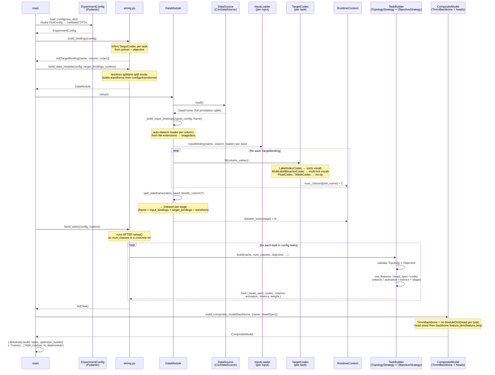
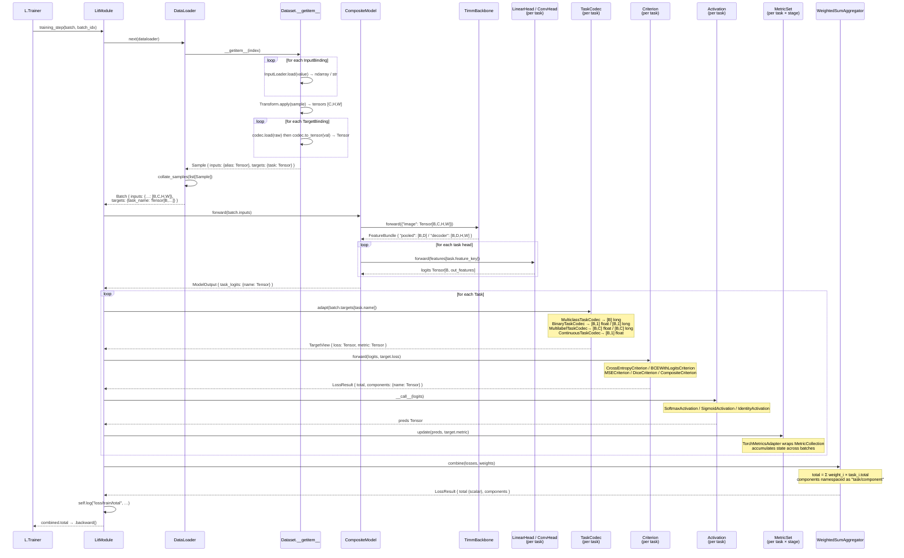
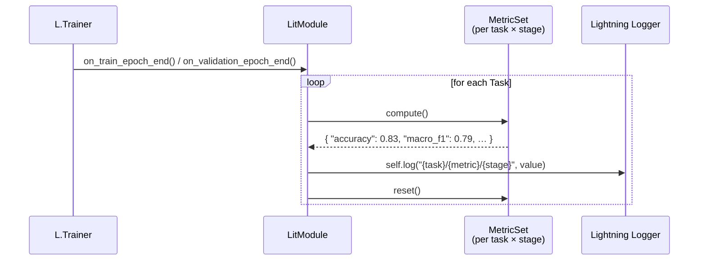

# Framework

Configuration-driven multi-task computer-vision training on top of PyTorch Lightning, Hydra, Pydantic, timm/smp, albumentations and torchmetrics.

---

## Phase 1 — Setup (runs once before `trainer.fit`)

---

## Phase 2 — Training step (repeats every batch)

---

## Epoch end — metrics flush

---

## Key names

| Concept | Class / function |
|---|---|
| Validated config root | `ExperimentConfig` |
| Data annotation source | `CsvDataSource` / `JsonDataSource` |
| Data mode: single file + split | `data.sources: str/list` + `data.split` |
| Data mode: pre-split files | `data.sources: {train: ..., val: ...}` |
| Stratified split | `data.split_stratify: column` (auto-detects categorical/numeric/multilabel) |
| Dataset size cap | `data.max_samples: int / float` |
| Input column(s) config | `data.inputs: str / dict[alias, column] / dict[alias, {column, loader}]` |
| Input column → loader binding | `InputBinding(name, column, loader)` |
| Input loader port | `InputLoader` (ABC) — `ImageLoader` / `TextLoader` (registered in `input_loaders`) |
| Data-layer target decoder | `LabelIndexCodec` / `MultiLabelBinarizeCodec` / `FloatCodec` / `MaskCodec` |
| Target column → codec binding | `TargetBinding(name, column, codec)` |
| Plain data orchestrator | `DataModule` |
| Data wiring helper | `build_data_module(config, target_bindings, runtime)` |
| Lightning data wrapper | `LitDataModule` |
| Per-item assembly | `Dataset.__getitem__` |
| Input transform (YAML-driven) | `AlbumentationsTransform` — built from `configs/transforms/*.yaml` |
| Augmentation pipeline config | `_target_`-keyed YAML; `instantiate(spec)` builds it recursively |
| Batching | `collate_samples` |
| Phase-agnostic batch | `Batch` |
| Backbone output | `FeatureBundle` (named streams: `"pooled"`, `"decoder"`, …) |
| Head build instruction | `HeadSpec(kind, out_features, feature_key)` |
| Backbone + heads | `CompositeModel` |
| Image backbone | `TimmBackbone` |
| Dense (seg) backbone | `SmpBackbone` |
| Heads | `LinearHead` / `ConvHead` |
| Forward output | `ModelOutput` |
| Task bundle | `Task(name, head_spec, codec, criterion, activation, metrics, weight)` |
| Output structure axis | `TopologyStrategy` → `GlobalTopology` / `DenseTopology` |
| Label semantics axis | `ObjectiveStrategy` → `Multiclass` / `Binary` / `Multilabel` / `Continuous` |
| Task assembler | `TaskBuilder` |
| User-facing preset | `classification(…)` / `segmentation(…)` / `regression(…)` |
| Task-layer target shaping | `MulticlassTaskCodec` / `BinaryTaskCodec` / `MultilabelTaskCodec` / `ContinuousTaskCodec` |
| Adapted target | `TargetView(loss, metric)` |
| Loss brick | `CrossEntropyCriterion` / `BCEWithLogitsCriterion` / `MSECriterion` / `DiceCriterion` / `CompositeCriterion` |
| Loss result | `LossResult(total, components)` |
| Post-logit activation | `SoftmaxActivation` / `SigmoidActivation` / `IdentityActivation` |
| Metric collection | `TorchMetricsAdapter` wrapping `torchmetrics.MetricCollection` |
| Loss combiner | `WeightedSumAggregator` |
| Per-head LR | `OptimizerBuilder` |
| Training orchestrator | `LitModule` |
| Runtime inference | `RuntimeContext.num_classes` — populated by `DataModule.setup()` |
| Extension point | `Registry` — `@registry.register("key")` |
| YAML brick spec | `instantiate(spec, registry?)` — recursive; `"key"` / `{name, params}` / `{_target_}` / nested lists |
