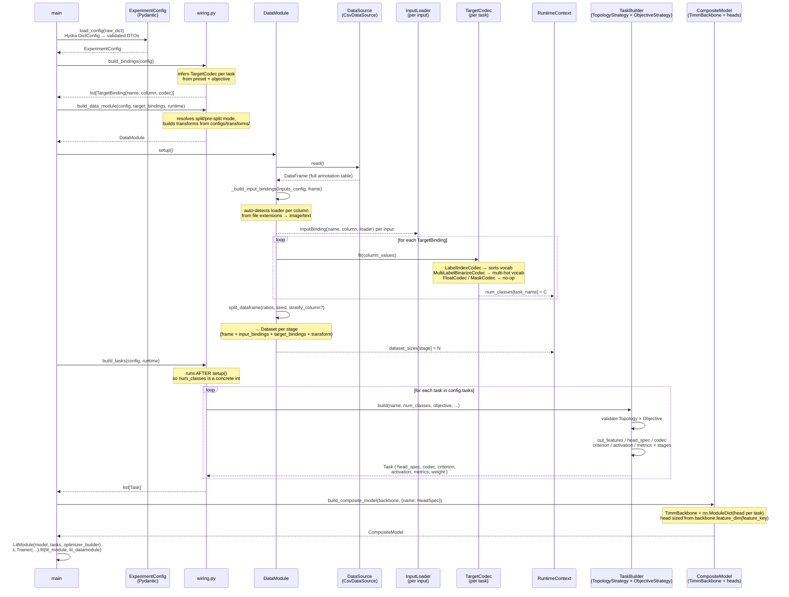
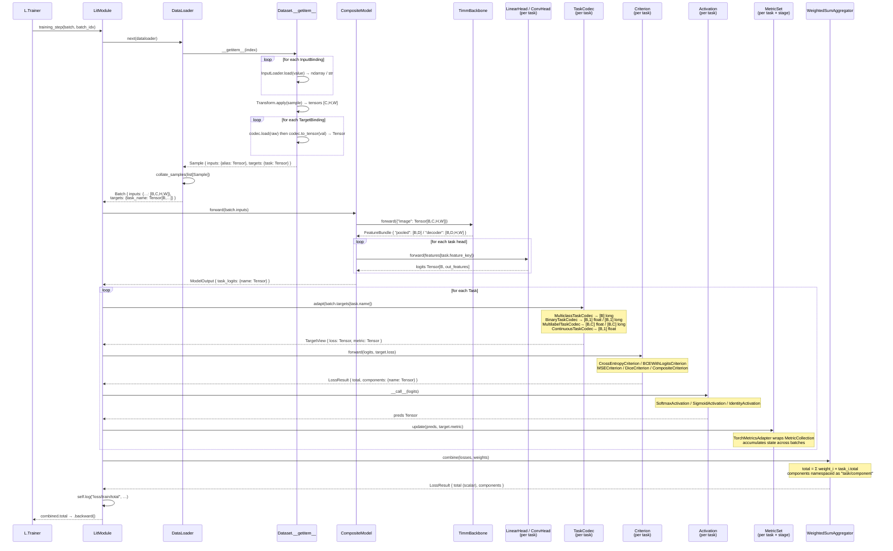
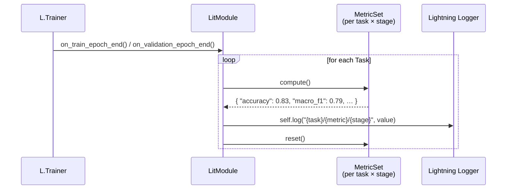

# Framework

Configuration-driven multi-task computer-vision training on top of
PyTorch Lightning · Hydra · Pydantic · timm / smp · albumentations · torchmetrics.

---

## Table of contents

- [Quick start](#quick-start)
- [Core concepts](#core-concepts)
- [Configuration guide](#configuration-guide)
  - [How components are built](#how-components-are-built)
  - [Data](#data)
  - [Tasks & presets](#tasks--presets)
  - [Backbone](#backbone)
  - [Optimizer & LR](#optimizer--lr)
  - [Callbacks](#callbacks)
  - [Logger](#logger)
- [Recipes](#recipes)
- [CLI reference](#cli-reference)
- [Extending the framework](#extending-the-framework)
- [Internals](#internals)

---

## Quick start

```bash
uv sync           # install dependencies
make test         # verify everything works
```

The entry point is `main.py`. All configuration lives in `configs/`.
Run with the built-in debug experiment (synthetic data, CPU, 2 epochs):

```bash
uv run python main.py
```

To point at your own data, override the experiment:

```bash
uv run python main.py +experiment=my_exp
```

---

## Core concepts

**A Task is a composition of three orthogonal axes.** A *topology* defines the output
structure (global per-sample, dense per-pixel, …); an *objective* defines label semantics
(multiclass / multilabel / binary / continuous); a *modality* defines the input side
(image / embedding / …). Familiar names — `classification`, `segmentation` — are thin
presets over this composition. `segmentation(objective="multilabel")` works out of the
box with no extra code; adding a new variant is one `objective:` change in YAML.

**`num_classes` is never hardcoded.** The data module reads and fits target codecs at
setup time, populates a `RuntimeContext`, and only then are tasks and model heads built
with concrete output dimensions. Class counts flow from data → runtime → model
automatically.

**Hydra groups = swappable building blocks.** Backbone, optimizer, transforms, logger,
callbacks, and trainer are independent config groups. Combine them freely; override any
key via CLI without touching shared config files.

---

## Configuration guide

### How components are built

Most of the config maps directly onto Python objects. There are **two construction
families** — knowing which one a section uses tells you how to customize it.

**1. Typed sections** — a fixed schema with one dedicated builder. A `kind` (or `name`)
field selects the registry adapter; the remaining fields are forwarded to it as
constructor arguments. Used by `backbone`, `optimizer`, `data`, `dataloader`, `logger`.

```yaml
backbone: {kind: smp, name: unet, encoder_name: resnet34}   # kind → adapter; encoder_name forwarded
optimizer: {name: adamw, lr: ${lr}, weight_decay: 1.0e-4}    # name → optimizer class; rest forwarded
```

**2. Brick-specs** — free-form, with three interchangeable forms. Used by `loss`,
`metrics`, `target_codec`, `head`, `callbacks`, and the `transform` inside a batch
transform.

| Form | YAML | Meaning |
|---|---|---|
| string | `loss: cross_entropy` | registry key, default args |
| name + params | `loss: {name: cross_entropy, label_smoothing: 0.1}` | registry key + kwargs |
| `_target_` | `loss: {_target_: my_pkg.MyLoss, alpha: 0.3}` | import path, no registration needed |

The first two forms look the component up in a **registry** (short, discoverable names);
`_target_` imports any class by dotted path — the escape hatch for code you didn't
register. Both reach the same constructor; pick by whether the thing is registered.

**Nested graphs.** A `_target_` spec is resolved recursively, so object trees can be
built inline (e.g. an Albumentations pipeline):

```yaml
transforms:
  train:
    _target_: albumentations.Compose
    transforms:
      - {_target_: albumentations.HorizontalFlip}
      - {_target_: albumentations.Normalize}
      - {_target_: albumentations.pytorch.ToTensorV2}
```

Inside a `_target_`, only `_target_` is available — registry short-names are a
top-level convenience.

**Runtime values are injected, never written.** `num_classes` and similar are inferred
from data at `setup()` and injected into the components that need them — which is why you
never write `num_classes` in a loss / metric / transform spec. Any param you set
explicitly overrides an injected default.

**To customize a component** (both shown in [Extending the framework](#extending-the-framework)):
register your class under a short key (`@registry.register("my_key")`) and use the `name`
form, **or** skip registration and point `_target_` straight at it.

> Unlike raw Hydra, `_partial_` and positional `_args_` are not supported — components
> take keyword arguments.

---

### Data

**Split mode** — one file, ratios decide the split:

```yaml
data:
  sources: data/annotations.csv
  inputs: image_path          # shorthand: single image column
  split:
    train: 0.8
    val:   0.1
    test:  0.1
```

**Pre-split mode** — separate files per stage:

```yaml
data:
  sources:
    train: data/train.csv
    val:   data/val.csv
  inputs: image_path
```

**Multiple inputs** (multi-view, multimodal):

```yaml
data:
  inputs:
    image:   image_path        # loader auto-detected from extension
    depth:   depth_path        # another image column
    caption: {column: text_col, loader: text}   # explicit loader
```

**Cap dataset size** for fast iteration:

```yaml
data:
  max_samples: 500       # int → exactly N rows
  max_samples: 0.1       # float → 10% of data
```

---

### Tasks & presets

Tasks are declared as a named dict. The key becomes the task name used in metric logs
(`label/accuracy/val`), loss logs (`loss/val/label`), and per-head LR overrides.

**Classification** (multiclass by default):

```yaml
tasks:
  species:
    preset: classification
    target: species_col
    class_mapping: {0: cat, 1: dog, 2: cow}   # infers num_classes=3
```

**Segmentation**:

```yaml
tasks:
  mask:
    preset: segmentation
    target: mask_path
    class_mapping: {0: background, 1: defect, 2: edge}   # infers num_classes=3
```

Or with explicit `num_classes` when class names don't matter:

```yaml
tasks:
  mask:
    preset: segmentation
    target: mask_path
    num_classes: 3
```

**Regression**:

```yaml
tasks:
  age:
    preset: regression
    target: age
    dim: 1
```

**Objective override** — same preset, different label semantics:

```yaml
tasks:
  tags:
    preset: classification
    objective: multilabel       # sigmoid + BCE instead of softmax + CE
    target: tags_col
    class_mapping: {0: indoor, 1: outdoor, 2: people}
```

Available objectives: `multiclass` · `multilabel` · `binary` · `continuous`.

**Custom loss**:

```yaml
tasks:
  mask:
    preset: segmentation
    target: mask_path
    num_classes: 3
    loss:
      name: weighted_sum
      losses: {cross_entropy: 1.0, dice: 2.0}
```

**Custom metrics**:

```yaml
tasks:
  species:
    preset: classification
    target: species_col
    class_mapping: {0: cat, 1: dog, 2: cow}
    metrics:
      accuracy: null
      per_class_f1:
        name: f1
        average: none           # returns [C] vector → logged per class
      confusion_matrix: null
```

**Per-head learning rate** (see [Optimizer & LR](#optimizer--lr)):

```yaml
tasks:
  mask:
    preset: segmentation
    target: mask_path
    num_classes: 3
    optimizer:
      lr: 1.0e-4                # this head gets its own param group
```

---

### Backbone

Select the backbone group in `defaults` or override it:

```yaml
defaults:
  - backbone: resnet18    # configs/backbone/resnet18.yaml
```

| Group file | Architecture | Key |
|---|---|---|
| `resnet18.yaml` | timm ResNet-18 | `timm` |
| `smp_unet.yaml` | smp U-Net (ResNet-34 encoder) | `smp` |
| `smp_dpt.yaml` | smp DPT | `smp` |

**timm backbone** (any model from the timm registry):

```yaml
backbone:
  kind: timm
  name: efficientnet_b3
  pretrained: true
```

**smp backbone** for segmentation or multi-task:

```yaml
backbone:
  kind: smp
  name: unet
  encoder_name: resnet34
  pretrained: true
```

SMP exposes two feature streams:

| Key | Shape | Use for |
|---|---|---|
| `decoder` | `[B, D, H, W]` | segmentation head (default for `segmentation` preset) |
| `encoder_last` | `[B, D, H, W]` | classification head with SMP's internal pooling |

For **multi-task on a single smp backbone**, set `feature_key` per task:

```yaml
tasks:
  mask:
    preset: segmentation
    target: mask_path
    num_classes: 3
    # feature_key: decoder  ← default, no need to write

  label:
    preset: classification
    target: label
    class_mapping: {0: cat, 1: dog}
    feature_key: encoder_last   # explicit: use encoder output, not decoder
```

---

### Optimizer & LR

```yaml
lr: 1.0e-3          # global LR — all param groups start here

optimizer:
  name: adamw       # registry key: adamw · sgd · adam
  lr: ${lr}         # references the top-level lr
  weight_decay: 1.0e-4
```

Available optimizer groups: `adamw.yaml` · `sgd.yaml`.

**Per-head LR override**: add an `optimizer:` block to any task. That head gets its own
param group; the backbone uses the global `lr`.

```yaml
tasks:
  mask:
    preset: segmentation
    target: mask_path
    num_classes: 3
    optimizer:
      lr: 5.0e-5    # decoder head trains slower than backbone
```

---

### Callbacks

`callbacks` is a dict of `{registry_key: params}` — the same pattern as `metrics`.
Keys are looked up in `callback_registry`; values are constructor kwargs (`null` = all defaults).
Declaration order in YAML controls registration order, which matters: put `ema` before `checkpoint`.

```yaml
# configs/callbacks/default.yaml
lr_monitor:
  logging_interval: epoch

ema:
  decay: 0.999
  warmup_fraction: 0.1
  use_buffers: true

checkpoint:
  monitor: loss/val/total
  mode: min
  save_top_k: 1
  save_weights_only: true
```

Select a group in `defaults`:

```yaml
defaults:
  - callbacks: default    # lr_monitor + ema + checkpoint
  # - callbacks: minimal  # checkpoint only
  # - callbacks: none     # no callbacks (smoke tests)
```

| Key | Callback | What it does |
|---|---|---|
| `lr_monitor` | `LearningRateMonitor` | Logs learning rates to the experiment logger |
| `ema` | `EmaCallback` | Maintains an EMA shadow; validation and checkpoints use EMA weights |
| `checkpoint` | `ModelCheckpoint` | Saves the best model by a monitored metric |
| `freeze` | `FreezeCallback` | Freezes modules for the first N epochs, then unfreezes |

**Disable a callback at runtime** — delete its key with the `~` prefix:

```bash
uv run python main.py 'defaults=[{override /callbacks: default}]' '~callbacks.ema'
```

**Add freeze** without editing the group file — extend the dict in an experiment config:

```yaml
# configs/experiment/finetune.yaml
callbacks:
  freeze:
    targets: [model.backbone]
    unfreeze_at: 0.3    # fraction of max_epochs; int = epoch index; -1 = never
    train_bn: false
```

**Custom callback** via `_target_` (no registration needed):

```yaml
callbacks:
  my_cb:
    _target_: my_project.callbacks.GradientClipCallback
    max_norm: 1.0
```

**EMA + checkpoint**: when EMA is active, the checkpoint automatically saves EMA weights —
no special setup needed. EMA weights are swapped in before validation (where checkpoint
monitors the metric) and swapped back after.

---

### Logger

```yaml
defaults:
  - logger: none       # no logging (default)
  - logger: clearml    # ClearML experiment tracking
```

**ClearML** config:

```yaml
logger:
  kind: clearml
  project: my-project   # defaults to experiment project
  task: run-001         # optional task name
```

Override at runtime:

```bash
uv run python main.py 'defaults=[{override /logger: clearml}]'
```

---

## Recipes

### Single-task classification

```yaml
# configs/experiment/classify_pets.yaml
# @package _global_
defaults:
  - override /backbone: resnet18
  - override /callbacks: default

project: pets
epochs: 20
batch_size: 32
image_size: [224, 224]
lr: 1.0e-3

data:
  sources: data/pets.csv
  inputs: image_path
  split: {train: 0.8, val: 0.1, test: 0.1}

tasks:
  species:
    preset: classification
    target: species
    class_mapping: {0: cat, 1: dog, 2: rabbit}
```

```bash
uv run python main.py +experiment=classify_pets
```

---

### Multi-task: classification + segmentation on one backbone

```yaml
# configs/experiment/multitask.yaml
# @package _global_
defaults:
  - override /backbone: smp_unet
  - override /callbacks: default

project: multitask-demo
epochs: 30
batch_size: 8
image_size: [512, 512]
lr: 1.0e-3

data:
  sources: data/annotations.csv
  inputs: image_path
  split: {train: 0.8, val: 0.1, test: 0.1}

tasks:
  mask:
    preset: segmentation
    target: mask_path
    class_mapping: {0: background, 1: defect, 2: edge}
    loss: {name: weighted_sum, losses: {cross_entropy: 1.0, dice: 1.0}}

  label:
    preset: classification
    target: label
    class_mapping: {0: ok, 1: defective}
    feature_key: encoder_last
    optimizer:
      lr: 5.0e-4
```

---

### Fine-tuning with frozen backbone

```yaml
# configs/experiment/finetune.yaml
# @package _global_
defaults:
  - override /callbacks: default

project: finetune
epochs: 40
lr: 5.0e-4

# Extend the default callback set with freeze.
# Declare freeze before checkpoint so unfreezing runs before the save decision.
callbacks:
  freeze:
    targets: [model.backbone]
    unfreeze_at: 0.25   # unfreeze after 25% of epochs

# ... data and tasks as usual
```

---

### Fast debugging

```yaml
# configs/experiment/debug_quick.yaml
# @package _global_
defaults:
  - override /trainer: cpu_smoke
  - override /callbacks: none
  - override /logger: none

epochs: 2
batch_size: 4
image_size: [64, 64]

data:
  max_samples: 100

# ... tasks as usual
```

---

## CLI reference

Override any config value directly — standard Hydra syntax:

```bash
# change a scalar
uv run python main.py epochs=5 batch_size=64

# swap a config group
uv run python main.py 'defaults=[{override /backbone: smp_unet}]'

# load a full experiment override
uv run python main.py +experiment=classify_pets

# combine experiment + group swap
uv run python main.py +experiment=classify_pets 'defaults=[{override /logger: clearml}]'

# disable a callback (deletes the key from the dict)
uv run python main.py 'defaults=[{override /callbacks: default}]' '~callbacks.ema'

# per-task LR from CLI
uv run python main.py 'tasks.mask.optimizer.lr=1e-5'
```

---

## Extending the framework

Every component is a registry key. Register your own with the `@registry.register` decorator — importing the module is enough to make it available.

**Custom loss**:

```python
# src/losses/my_loss.py
from src.losses.registry import criteria

@criteria.register("focal_tversky")
class FocalTverskyLoss(nn.Module, Criterion):
    ...
```

```yaml
tasks:
  mask:
    loss: {name: focal_tversky, alpha: 0.7, beta: 0.3}
```

**Custom metric**:

```python
from src.metrics.registry import metric_factories
metric_factories.register("my_metric")(MyTorchMetric)
```

```yaml
tasks:
  label:
    metrics:
      my_score:
        name: my_metric
        some_param: 42
```

**Custom callback**:

```python
# src/callbacks/my_callback.py
import lightning as L
from src.callbacks.registry import callback_registry

@callback_registry.register("gradient_clip")
class GradientClipCallback(L.Callback):
    def __init__(self, max_norm: float = 1.0) -> None:
        if max_norm <= 0:
            raise ValueError(f"max_norm must be positive, got {max_norm}.")
        self._max_norm = max_norm

    def on_before_optimizer_step(self, trainer, pl_module, optimizer):
        import torch
        torch.nn.utils.clip_grad_norm_(pl_module.parameters(), self._max_norm)
```

Import the module once (e.g. in `main.py`) so the decorator runs, then use it by key:

```yaml
callbacks:
  gradient_clip:
    max_norm: 0.5
```

Or use `_target_` to skip registration entirely:

```yaml
callbacks:
  my_clip:
    _target_: src.callbacks.my_callback.GradientClipCallback
    max_norm: 0.5
```

---

**Custom data source** (e.g. Parquet):

```python
from src.data.sources import data_sources, FileDataSource

@data_sources.register("parquet")
class ParquetDataSource(FileDataSource):
    def _read_file(self, path: str) -> pd.DataFrame:
        return pd.read_parquet(path)
```

```yaml
data:
  sources: data/annotations.parquet
  source_type: parquet
```

---

## Internals

The diagrams below show the full data flow for readers who want to understand or extend the framework internals.

### Phase 1 — Setup (runs once before `trainer.fit`)



### Phase 2 — Training step (repeats every batch)



### Epoch end — metrics flush


