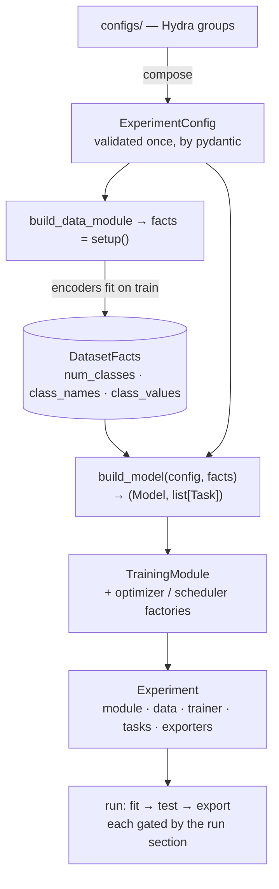

# Core concepts

Ten concepts are the whole vocabulary. Everything else in the code is an implementation
detail behind one of them, and each has a guide for when a detail matters.

| Concept | In one sentence |
|---|---|
| `Sample` / `Batch` | What the data layer produces: named inputs and targets, one row and then a collated batch. |
| `ComponentConfig` | The one grammar for naming something to build: `name` or `_target_`, every other key a constructor argument. |
| `TaskKind` | The class that says how a kind of task is served: encoder, head, loss, activation, metrics, drawing. |
| `Task` | A named instance of a kind, with the facts the data revealed about it, a weight and a learning rate. |
| `TargetEncoder` | Column cell → training value: fitted on the train split, `load` before the transforms, `encode` after. |
| `TableDataModule` | Sources + schema + split + transforms → per-stage datasets, and the facts `setup()` returns. |
| `Backbone` | Named feature streams with known widths; the composite family puts one head per task on it. |
| `Model` | `step(batch)` → loss, prediction, targets; `predict(batch)` → prediction; whichever family built it. |
| `Loss` | A total and its named parts; `+`, `*` and `.scoped()` are the whole algebra. |
| `TrainingModule` / `TrainingData` | Lightning, and nothing else is. |

They are introduced below in the order a run meets them.

## A sample, then a batch

`Sample` is one annotation row read into memory: `inputs` (an image, token ids), `targets`
keyed by task name, `auxiliary_inputs` only the augmentations read (a mask that bounds a
transform), and `meta` (the row's cells, for the page that draws it). `Batch` is the
collated form — tensors, and for a ragged target such as boxes an `Instances` value —
with `to(device)`. Nothing above the data layer sees a row, a path or a DataFrame.

→ [Data](guides/data.md)

## One grammar for every component

Any component the framework builds is declared the same way:

```yaml
loss: cross_entropy                                  # a registry name
loss: {name: cross_entropy, label_smoothing: 0.1}    # a registry name, with arguments
loss: {_target_: my_pkg.FocalLoss, gamma: 2.0}       # an import path, for anything unregistered
```

Exactly one of `name` or `_target_`; every other key becomes a constructor
argument, so an upstream knob is reachable without a schema change. A nested
component builds from `_target_` only — a nested position has no registry
context. Hydra's other meta-keys (`_partial_`, `_args_`) are *rejected* rather
than ignored: silently dropping one would hand back an instance where a factory
was asked for.

A section's shape follows what identifies an entry: a **dict** when the keys are
identities something downstream consumes (task names, metric labels, stages), a
**list** when order is the semantics and identity is intrinsic (callbacks, loss
parts).

→ [Extending the framework](guides/extending.md)

## A task is a kind

There is no `TaskType` enum and no table of axes. A task is an instance of one
`TaskKind` class, named in config:

```yaml
tasks:
  species: {kind: classification, target: species}
  mask:    {kind: segmentation, target: mask_path}
```

A kind states, in one class in `src/tasks/kinds.py`, everything the framework
needs to serve it: which encoder its target starts from, which backbone streams
its head reads and what head that is, its loss, how its logits become predictions,
what it is judged by, whether a batch transform may mix it, and how a sample of it is
drawn. `Segmentation` shares its label semantics with `Classification` and its shape
with `BinarySegmentation` by inheritance. A kind of your own is a subclass, reachable
as `kind: {_target_: my_pkg.Depth}` with no edit to the framework
([ADR-0003](adr/0003-a-task-is-a-kind.md)).

Two vocabularies stay in `core/taxonomy.py` beside the kinds: `OutputTopology`, the
shape of one prediction (`global`, `dense`, `instances`), which is what a batch
transform or a page branches on; and `Modality`, the names of inputs (`image`,
`embedding`, `text`, …), open to what an experiment declares.

→ [Tasks and kinds](guides/tasks.md)

## Sizes come from the data, never from config

A `Task` is a name, a kind, the facts the data revealed about it, a weight and a
learning rate. `num_classes` is never written in a config file: it is the length of the
vocabulary a task declares. The data module fits its target encoders on the train split
— validating it against the declared vocabularies, learning a bin range — returns the
facts from `setup()`, and *only then* are tasks and heads built:

```
facts = setup()  →  Task  →  Head(in_features, out_features)
```

The facts travel as ordinary arguments, passed by the caller that knows them: a head
is built at `in_features` and `out_features`; a criterion sized by the task says so on
its class (`sized(facts, embedding_dim)`); an encoder with a vocabulary takes `classes`;
a transform is bound to the arrays it carries (`with_geometry`); a callback reads the
tasks off the module in `setup`. Nothing is matched by name against a signature, with
one exception for constructors the framework does not own: torchmetrics metrics and
torch schedulers receive the facts they *name* (`fill_signature`)
([ADR-0004](adr/0004-explicit-facts-not-signature-injection.md)).

A fact written in config as well is refused by name where the two would meet
(`num_classes` on a metric, `in_features` on a head), never allowed to win
silently. The rule reads the other way too: a value **config already holds**
reaches a component through config, by interpolation — `${lr}`, `${epochs}`,
`${mean}`, `${run.directory}` — never through a function in the composition root, so one
declaration serves every reader.

## A target encoder

A `TargetEncoder` turns a column cell into a training value in two steps: `load`
runs before the transforms (a mask path becomes a plane, a JSON cell becomes boxes),
`encode` after them (a class name becomes an index, a value becomes a distribution over
bins). It is fitted on the train split alone and reports what it found as the task's
facts — the class vocabulary, the class names, the bin centres. An encoder whose target
lives in image space declares its `geometry`, so the transforms carry it as a mask or as
boxes without a word in config. Each kind names the encoder its target starts from; a
task may declare another one.

→ [Data](guides/data.md) · [Transforms](guides/transforms.md)

## The table pipeline

`TableDataModule` is the one pipeline: annotation rows in, per-stage datasets out. It
reads the sources (one table the splitter divides, or tables already divided upstream),
builds the schema from the declared inputs and the tasks' targets, applies the
per-stage transforms, and serves file reads from a cache when one is declared.
`setup()` fits the encoders and returns the dataset's facts; `dataset(stage)` is what
training reads. It implements the `DataModule` port, which is all the training layer
knows about data.

→ [Data](guides/data.md)

## A backbone

A `Backbone` produces `Features`: named streams of known width — `features` (`[B, D]`),
`encoder` and `decoder` maps, `embeddings` (`[B, N, D]`), a detection pyramid by stride.
`feature_dim(stream)` is what sizes a head; `pyramid()` names the levels a dense or
instance head reads; `native_head` offers the library's own head for a task that asks
for it. Third-party networks come through adapters — timm, smp, transformers,
ultralytics — and the port never bends toward a library's signatures.

→ [Models](guides/models.md)

## A model, in one of two families

A `Model` is what trains: `step(batch)` returns the loss, the predictions and the
targets as the metrics read them; `predict(batch)` is inference; `task_parameters`
and `criterion_of` let the optimizer and the callbacks address one task. Two families
satisfy it. A model **composed** by the framework — `CompositeModel` — is a backbone
with one head and one criterion per task, and is what a `Backbone` in the `model`
section builds. A model that **arrives whole** — any `Model` reached by `_target_` —
owns its head, loss and decoding, and is taken as it is
([ADR-0002](adr/0002-a-whole-model-is-a-target.md)). A distilled model is a decorator
that adds one term to the student's step. The training loop, checkpointing, metrics
and tracking never learn which they are holding:

```python
result = model.step(batch)  # one forward: loss + predictions + metric-view targets
result.loss.total.backward()
```

→ [Models](guides/models.md)

## A loss with named parts

`Loss` carries a total and its named parts, and `+`, `*` and `.scoped()` are enough for
weighting and multi-task totals alike, which is why there is no aggregator class:

```python
total = Loss.sum(task.weight * loss.scoped(task.name) for ...)
```

Parts become log keys under the one grammar `{stage}/{task}/{leaf}` —
`train/species/ce`, `val/mask/dice` — which is also what puts train, val and test
of one number on a single graph.

→ [Losses](guides/losses.md) · [Logging](guides/logging.md)

## Lightning, in one place

`TrainingModule` runs any `Model` through Lightning: one class for every family. It
holds the metric sets per task and stage as submodules, publishes the run's `tasks` for
the callbacks that need them, and takes the optimizer and scheduler as factories.
`TrainingData` turns the pipeline's stage datasets into loaders, with the stage
conventions fixed (training shuffles and may drop its last batch, evaluation does
neither). Lightning is imported here, in the callbacks and loggers that are its own
extension points, and in the composition root that builds the `Trainer` — nowhere else.

→ [Training](guides/training.md) · [Callbacks](guides/callbacks.md)

## The build order is the contract



`setup()` before `build_model` is the whole reason head sizes come from data. It holds
for a composed model and for one that arrives whole alike, which is why it lives in the
body of `build()` and not inside any model. `build()` names no concrete model:
`build_model` returns `(Model, list[Task])`, composing a `Backbone` and taking a `Model`
as it is ([ADR-0001](adr/0001-one-composition-root.md)).

## The dependency rule

```
cli.py + build.py      composition root: Hydra composes, one grammar builds
      │ creates and wires
capability packages    data · models · tasks · losses · metrics · transforms ·
      │                training · callbacks · loggers · export · visualization
      │ implement and consume
core/                  entities · ports · taxonomy · the log-key grammar — torch and stdlib only
```

Arrows point down only. The core never imports a capability; a capability reads
only its own section of `config/`, through its `build.py`; the whole config is read
by the composition root alone. That is what keeps third-party libraries contained:
Lightning lives in `training/`, pydantic in `config/`, Hydra's composition in
`cli.py`, and a fact one package derives reaches another as a plain argument.

Between capabilities the arrows are few and named: a capability consumes another only
through what it publishes — a port, an entity, a registry — the graph is a DAG, and the
edges that exist are pinned in `tests/unit/test_layering.py`, so a new one is a decision
recorded there, not a drift found later.

Besides entities and ports, `core/` owns the two rules several layers would otherwise
each spell for themselves — the log-key grammar (`log_keys`) and the closed-set check
behind a `Literal` knob (`choices`) — and the `Registry` every package catalogues its
names in, under `<package>/registry.py` as `<singular>_registry`. Our own components
register by decorator at their definition; third-party classes are registered
explicitly in that file.
