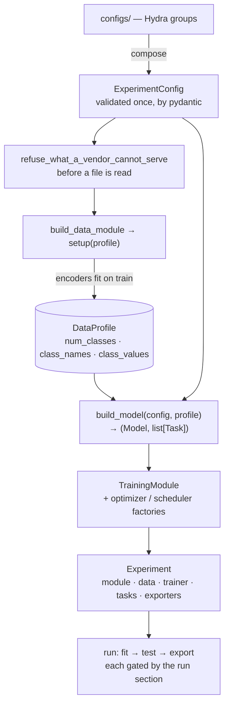

# Core concepts

Five ideas explain most of the framework. Everything else is a consequence of
them.

## A task is a composition, not a type

There is no `TaskType` enum. A task is a point on three orthogonal axes:

| Axis | Question it answers | Members |
|---|---|---|
| `Topology` | What does one prediction look like? | `global`, `dense`, `multiview`, `multistream`, `instances` |
| `Objective` | How do labels supervise it? | `multiclass`, `binary`, `multilabel`, `continuous`, `metric` |
| `Modality` | What kind of input feeds it? | `image`, `embedding`, `text`, … (open) |

Familiar names are thin **presets** over that composition, resolved while the
config loads and gone by the time anything is built:

```yaml
tasks:
  species: {preset: classification, target: species}
  mask:    {preset: segmentation, target: mask_path}
```

`segmentation` is `dense × multiclass`; `multilabel_segmentation` is
`dense × multilabel` — a different kind of task with no new code behind it. A
preset carries its point on the axes and its *customary metrics*, never a loss:
a loss default follows from one axis alone, so a preset has nothing to add.

Each axis owns its behaviour. `MulticlassObjective` knows what a multiclass task
is judged by, what criterion it takes, and how its logits become predictions;
`DenseTopology` knows a dense task reads `Stream.DECODER` through a conv head.
`build_task_components` composes the two and validates the pairing.

→ [Tasks and presets](guides/tasks.md)

## Sizes come from the data, never from config

`num_classes` is never written in a config file. The data module fits its target
encoders on the train split, records what it learned into a `DataProfile`, and
*only then* are tasks and heads built:

```
setup(profile)  →  DataProfile  →  Task  →  Head(in_features, out_features)
```

The mechanism is one function, `named_by`: assembly *offers* the facts it
computed, and each factory receives only the ones it names in its signature. A
metric that takes `num_classes` gets it; one that does not, does not.

The rule reads the other way too, and that half is the one that gets broken: a
value **config already holds** reaches a component through config, by
interpolation — `${lr}`, `${epochs}`, `${mean}`, `${run.directory}` — never
through a function in assembly. The derived channel outranks config, so a user
who declares such a value would have it silently ignored.

## One grammar for every component

Any component the framework builds is declared the same way:

```yaml
loss: cross_entropy                                  # a registry name
loss: {name: cross_entropy, label_smoothing: 0.1}    # a registry name, with arguments
loss: {_target_: my_pkg.FocalLoss, gamma: 2.0}       # an import path, for anything unregistered
```

Exactly one of `name` or `_target_`; every other key becomes a constructor
argument, so an upstream knob is reachable without a schema change. A nested
component builds from `_target_` only — a nested position has no registry
context. Hydra's other meta-keys (`_partial_`, `_args_`) are *rejected* rather
than ignored: silently dropping one would hand back an instance where a factory
was asked for.

A section's shape follows what identifies an entry: a **dict** when the keys are
identities something downstream consumes (task names, metric labels, stages), a
**list** when order is the semantics and identity is intrinsic (callbacks, loss
parts).

→ [Extending the framework](guides/extending.md)

## The dependency rule

```
cli.py + assembly/     composition root: Hydra composes, one grammar builds
      │ creates and wires
capability packages    data · models · tasks · losses · metrics · transforms ·
      │                training · callbacks · loggers · export · visualization
      │ implement and consume
core/                  entities · ports · taxonomy · the log-key grammar — torch and stdlib only
```

Arrows point down only. The core never imports a capability; a capability never
imports `config/`; only the composition root reads config. That is what keeps
third-party libraries contained: Lightning lives in `training/`, pydantic in
`config/`, Hydra in `cli.py`, and a capability that needs a fact from config
receives it as a plain argument.

"Entities and ports" is the shape of it, not the whole list. `core/` also owns the
few rules that two layers would otherwise each spell for themselves: the log-key
grammar (`log_keys`), the routing of a computed metric to the port its geometry
belongs to (`reporting`), what a declared class vocabulary must satisfy
(`vocabulary`), the closed-set check behind a `Literal` knob (`choices`), and the
normalisation constants the transforms and the samples grid have to agree on
(`normalisation`). Each is a rule with more than one reader and no dependency of
its own — torch and stdlib, like everything else here.

Each capability keeps its registries in `<package>/registry.py`, named
`<singular>_registry`. Our own components register by decorator at their
definition; third-party classes are registered explicitly in that file.

## Assembly is an order, and the order is the contract



`setup(profile)` before `build_model` is the whole reason head sizes come from
data. It holds for every model family — a vendor data module writes its own facts
into the same profile — which is why it lives in the body of `assemble()` and not
inside any family.

`assemble()` names no concrete family. `build_data_module` returns the
`DataModule` port and `build_model` returns `(Model, list[Task])`; those two
seams are where a YOLO-style family plugs in without a second assembler.

## One training step, whatever the family

```python
result = model.step(batch)     # one forward: loss + predictions + metric-view targets
result.loss.total.backward()
```

`CompositeModel.step` runs `Backbone → per-task Head → Criterion` and sums the
weighted task losses. A vendor adapter maps its native losses into `Loss.parts`
instead. A distilled model is a decorator that adds one term. The training loop,
checkpointing, metrics and tracking never learn which of the three they are
holding.

`Loss` is why there is no aggregator class: it carries a total and its named
parts, and `+`, `*` and `.scoped()` are enough for weighting and multi-task
totals alike.

```python
total = Loss.sum(task.weight * loss.scoped(task.name) for ...)
```

Parts become log keys under the one grammar `{stage}/{task}/{leaf}` —
`train/species/ce`, `val/mask/dice` — which is also what puts train, val and test
of one number on a single graph.

→ [Logging](guides/logging.md) · [Vocabulary](vocabulary.md)
