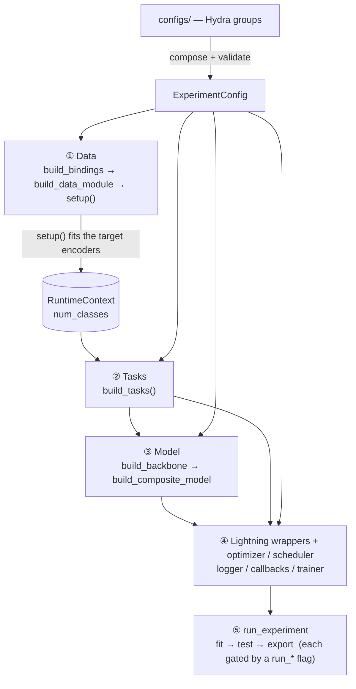
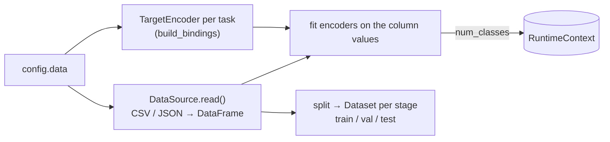
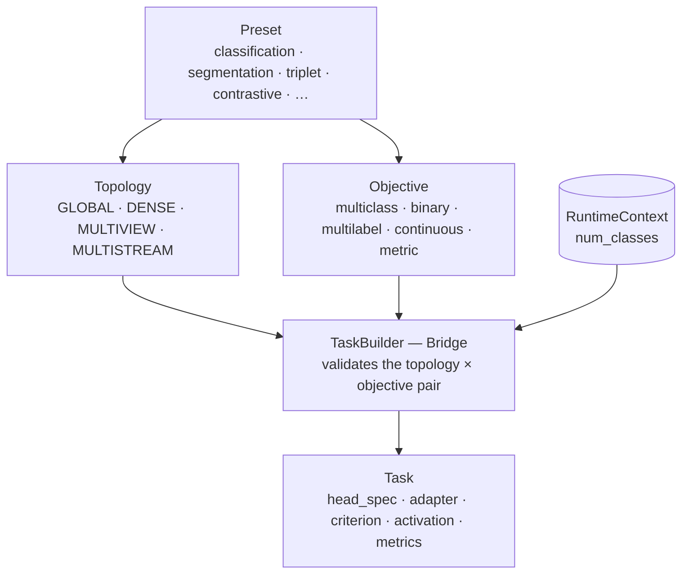
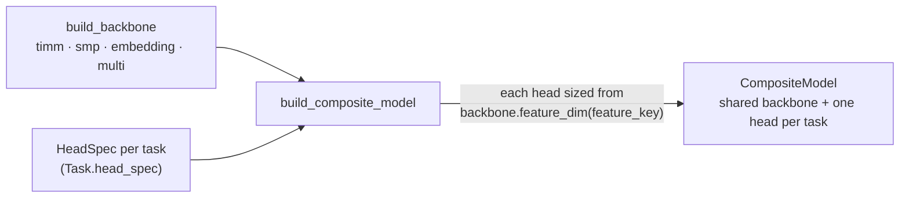
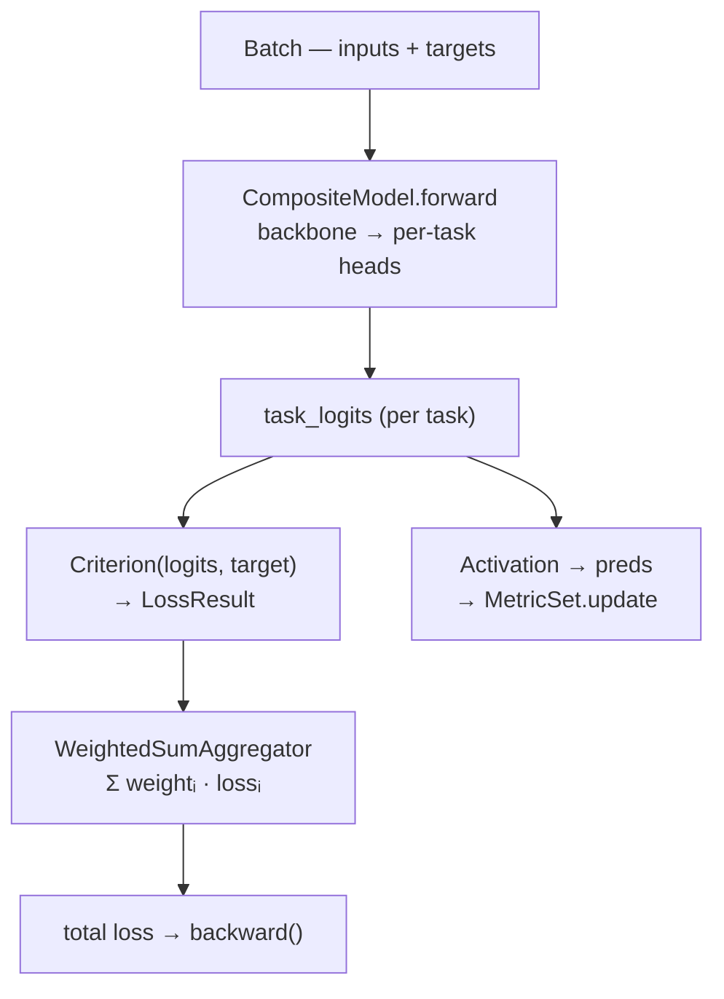

# Internals

The framework assembles an experiment in a fixed order — the same flat `build_*` sequence
that `main.py` runs. The diagrams below show the top-level blocks and how they connect; each
diagram after the first zooms into one block.

## The assembly pipeline

`setup()` is the hinge: it fits the target encoders and writes `num_classes` into the
`RuntimeContext`, so tasks and model heads — built *next* — always receive concrete output
sizes. Nothing is hardcoded or shared by reference across config, data, model, and module.

## ① Building the data

`build_data_module` then `setup()`: read the annotation table, fit the encoders (which
populate `num_classes`), and split into one `Dataset` per stage.

## ② Composing a task — the three-axis Bridge

A preset fixes a `(topology, default objective)` point; `TaskBuilder` validates the pair
(e.g. `metric` never pairs with DENSE — on GLOBAL it works via proxy classification
(`arcface_embedding`)) and assembles the bricks into one `Task`.

## ③ Assembling the model

One shared backbone plus one head per task; each head is sized from the backbone's feature
dimension for the stream it reads — so output sizes follow from data, never from config.

## ④ A training step

`forward` runs the backbone once and routes its features to each head; then, per task, the
criterion takes logits while the activation feeds metrics; the aggregator sums the weighted
task losses into the scalar that is back-propagated.

At epoch end each `MetricSet` is computed, logged as `task/metric/stage` (typed handlers
route scalars / per-class vectors / confusion matrices / curves), then reset.
